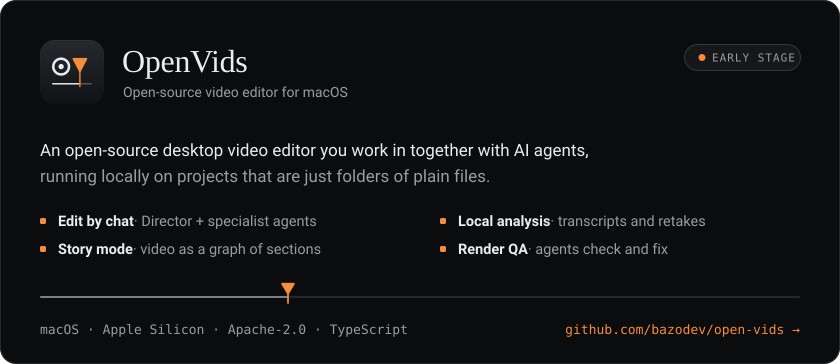

  

  Hi, I'm Roman, a developer based in Germany. 
  I build web apps, desktop tools and game tooling, mostly in TypeScript, with a growing focus on AI agents. 
  Right now I'm working on <a href="https://github.com/bazodev/open-vids"><b>OpenVids</b></a>, a video editor you edit together with an agent.

  

  <a href="https://github.com/bazodev/open-vids/releases/latest"><b>Download</b></a>
  &nbsp;·&nbsp;
  <a href="https://openvids.ai"><b>Website</b></a>
  &nbsp;·&nbsp;
  <a href="https://github.com/bazodev/open-vids"><b>Source</b></a>

  

  TypeScript · React · Next.js · Vue · Node · Bun · Python · Tauri · Luau · Telegram Mini Apps

  <a href="https://openvids.ai">openvids.ai</a>
  &nbsp;·&nbsp;
  <a href="https://x.com/bazodev">X / Twitter</a>
  &nbsp;·&nbsp;
  <a href="https://github.com/bazodev">GitHub</a>

